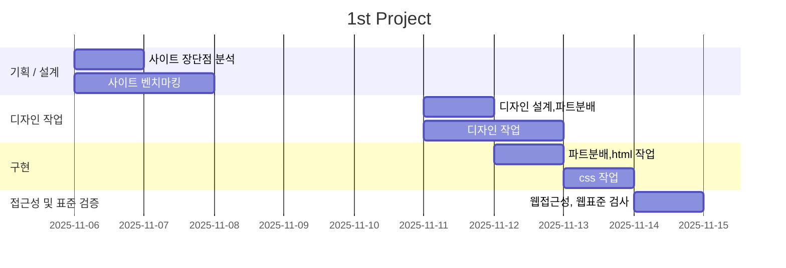

# 1st Project
- 과정명:오르미 프론트엔드 개발자 양성
- 기간:2025.10.16 ~ 2026.03.04
- 1차 프로젝트:2025.11.10 ~ 2025.11.14

## 빠른링크
- 기획서(피그마 슬라이드):[피그마 슬라이드](https://www.figma.com/slides/j3huT12zSspC9vNmvQYcsf/estsoft-1st-project-%EB%A0%88%EC%84%9C%ED%8C%90%EB%8B%A4?node-id=28-27&t=gxd8bYNrgWFK7hsE-1)
- 디자인 원본(피그마):[디자인 원본 링크](https://www.figma.com/design/JFGXspigeeG4BuhQ70xO0C/estsoft-1st-project-%EB%A0%88%EC%84%9C%ED%8C%90%EB%8B%A4?node-id=0-1&t=iRqYiRGGxY36eb7d-1)

## 1. 프로젝트 개요

### 1.1 목표
- **기존의 사이트 리뉴얼**: 기존의 이스트캠프 사이트의 불편한점, 장단점을 정리 후 단점을 보완하는 사이트 제작
- **디자인과 html,css, 협업 경험**: 디자인과 html, css를 작성하며 그 과정에서 협업을 하는 경험 쌓기
- **취업용 포트폴리오 활용**

### 1.2 팀원
| 이름 | 역할 | 주요 담당 | GitHub | 연락 |
| --- | --- | --- | --- | --- |
| 오세찬 | 팀장 · Tech Lead | common,header,banner,<br>nav,benefit,form | [@oh108899](https://github.com/oh108899) | oh108899@gmail.com |
| 김미경 | Design Lead | Curriculum,speciality,qna | [@meekyung] | garam@example.com |
| 이세나 | 디자인 · 회의록 정리 | review,footer | [@tpsk1545-netizen] | jiwoo@example.com |

### 1.3 마일스톤

#### 1일차: 기획/설계
- [ ] 현 사이트의 장단점 분석
- [ ] 타 사이트 벤치마킹
- [ ] 전체적인 사이트의 컨셉 구상

#### 2일차: 디자인 작업
- [ ] 디자인 파트 분배
- [ ] 디자인 작업

#### 3일차: 디자인, html 
- [ ] 디자인 작업 마무리
- [ ] html 파트 분배
- [ ] html 작성

### 4일차: html, css
- [ ] html 마무리
- [ ] css 파트 분배
- [ ] css 완성
- [ ] 피드백 수용 후 html, css 마무리

#### 5일차: 발표 준비 및 코드 정리
- [ ] 웹 접근성 검사, 웹 표준 검사
- [ ] 발표용 피그마 슬라이드 제작



### 1.5 주요 기능

- 측면 네비게이션 바를 통한 접근성 확대
- 취업 성공 스토리를 통한 신뢰도 제공

## 2. 개발 환경 및 배포

### 2.1 개발 스택
#### **Frontend**
- HTML
- CSS

#### **Tools**
- **Version Control**: Git & GitHub
- **Deployment**: VS-code
- **Design**: Figma

### 2.2 배포 URL
- https://oh108899.github.io/estsoft-1st-project-team1/

### 2.3 📚 개발 컨벤션

- [HTML 컨벤션](docs/guide_html.md)
- [CSS 컨벤션](docs/guide_css.md)
---

## 3.프로젝트 구조
```
ESTSOFT-1ST-PROJECT/
├── css/                  
│   ├── common.css        # 공통 변수, 유틸리티 클래스, 레이아웃
│                           기반 스타일
│   ├── main.css          # 메인 페이지 전용 스타일
│   ├── normalize.css     # 브라우저 간 일관성 확보
│   └── reset.css         # 모든 브라우저 기본 마진/패딩 초기화
│
├── docs/                 
│   ├── guide_css.md      # CSS 컨벤션
│   └── guide_html.md     # 시멘틱 태그 사용 기준, 접근성 체크리스트
│
├── images/               # 모든 정적 이미지 자산
│
├── index.html            # 메인 페이지 (단일 페이지로 구성된 교육 신청 사이트)
└── README.md
```

## 4. 제작 후기
이 프로젝트를 통해 처음으로 디자인 -> HTML/CSS 을 직접 해 보고 많은것을 느꼈습니다
### 1. 웹 접근성의 중요성
단순히 이쁘게만 만들게 아니라, 웹 접근성을 고려하여 이미지 alt와 같은것의 중요성, 키보드만으로도 불편함 없이 이용이 가능한지 등의 중요성을 배웠습니다

### 2. CSS의 설계
처음엔 그냥 생각나는대로 썼으나, 그 뒤에 클래스명의 겹침, 덮어쓰기 문제에 빠져 전체적으로 수정을 하여야 하는 수고러움에 빠졌습니다. 덕분에 CSS 작업을 하기 전 팀원들과의 충분한 협의 후 가이드와 컨벤션을 정해두고 common.css 와 main.css를 철저히 분리하여 작업하여야 한다는 것을 배웠습니다.

### 3. 디자인과 개발의 차이
처음엔 디자인과 개발은 완전히 관련이 없다고 생각하였으나, 작업을 해 보면서 추후 회사에서 작업을 할 때에 디자이너와 충분한 협의를 거치는 것의 필요성을 알게 되었습니다.

### 4. 아쉬웠던점 , 고칠점
- 아직 반응형과 자바스크립트를 배우지 않아 정적인 페이지만을 만들 수 있었던 것이 아쉽습니다. 다음 프로젝트에선 동적인것을 모두 포함하여 제작할 예정입니다.
- CSS 작성 전 충분한 협의가 이루어 지지 않아 코드 전체를 수정하는 일이 잦았습니다.

### 마무리
이 프로젝트를 하면서 '예쁜 것'과 '제대로 동작하는 것'의 간극을 크게 느꼈습니다. 또한 다른 프로그렘 툴 없이 하드코딩을 통해 제작한것이 큰 경험이 되었던것 같습니다. 이제 다른 도구를 사용하더라도 **사용자 입장에서 편한 사이트**를 만드는 개발자가 될 수 있도록 하겠습니다.